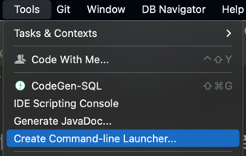

### IntelliJ Command Line

터미널에서 프로젝트로 이동 후

`idea .` 만 입력하면 

*해당 프로젝트를 IntelliJ 로 실행시킬 수 있다.*

겁나 간편- 하다.

### HOW TO ?

IntelliJ > Tools > Create Command-line Launcher

위 경로대로 따라 누르면 default 경로가 입력되어 있을 것이다.

그대로 OK 를 눌러주면 끝이다.

